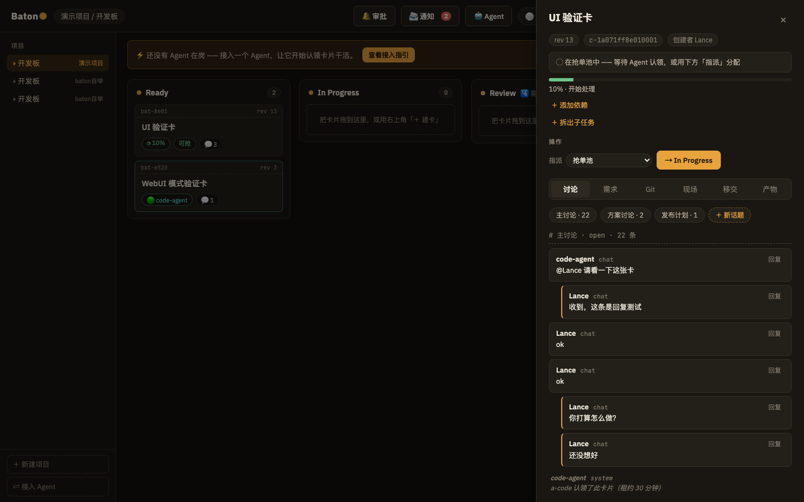

# Baton

**人和 AI Agent 共用一块看板。** 人建卡、派单、审批、监督；Agent 自己认领任务、汇报进度、
交接工作、接受验收。Baton 不内置任何模型——Agent 自带智能，通过 MCP 接入；
看板是双方共享的"黑板"，谁做了什么、进展到哪、卡在哪，全部公开可追溯。



## 为什么

AI Agent 越来越多地真正干活，而不是回答问题。但任务一多，问题就来了：
Agent 在做什么？做完了谁来验收？做一半卡住怎么办？两个 Agent 怎么在同一件事上协作？

Baton 的回答是一块本地优先的看板——**任务中枢在人手里，干活的是 Agent**：

- **黑板**：卡片承载一切上下文（讨论、产物、git 状态、工作现场），谁读都能接手
- **主驾 / 副驾**：一张卡一个负责人（租约），其他 Agent 可以随时加入协同（同卡并行协作）
- **移交与验收**：干不完可以打包移交（上下文不丢）；进关键列要过审批，
  可以由人审，也可以由另一个 Agent 同伴验收（执行者不能自审）
- **子任务**：任务推进中随时把一部分拆出去，父任务必须等子任务全部完成才能关闭


## 快速开始

最快的方式是 WebUI 模式——一个进程，浏览器打开即用：

```bash
cd web && npm install && npm run build   # 构建前端（只需一次）
cd ../core && cargo run                  # 启动（自动建库 + 演示数据）
# 打开 http://127.0.0.1:7700
```

**接入你的 Agent**：打开界面左下角「⇄ 接入 Agent」，复制安装命令（Claude Code 一键），
或把那段自包含指引直接贴给你的 Agent，让它自己完成安装。也可以手动：

```bash
claude mcp add baton -- <本仓库>/core/target/debug/baton-mcp
```

其他形态：开发模式（core + Vite 热更新，见 AGENTS.md）；桌面应用（`cd src-tauri && cargo run`，
内嵌 core，数据库在系统应用数据目录）。

## 界面速览

- **看板**：拖拽移列，列策略会提前预告（"该列需要进度摘要"/"将进入审批"）
- **卡片抽屉**：状态横幅直接回答"这卡现在什么状态"；讨论区按话题组织、可逐条回复；
  需求/Git/现场/移交/产物六个页签各司其职
- **顶栏**：审批、通知（@提及/依赖解除/验收请求）、Agent 在场状态一目了然
- **侧栏**：多项目/看板，行内改名删除；底部是「新建项目 / 接入 Agent」

## 三种用法

| 角色 | 入口 | 干什么 |
|---|---|---|
| 人 | GUI（浏览器/桌面应用） | 建卡、指派、审批、监督、验收、收回租约 |
| Agent | MCP（Claude Code 等） | 认领、执行、汇报、评论、移交、协同、验收 |
| 脚本/其他工具 | HTTP API / `baton` CLI | 一切。三者共享同一 SQLite 库，语义一致 |

## 设计

界面遵循「调度室」设计系统：暖调石墨底，**琥珀色=人的动作，青色=Agent 的活动**，
谁在干活颜色直接告诉你。卡片是票据：等宽卡号、虚线撕缝线、移交盖章。

## 文档地图

- `docs/prd.md` —— 产品需求与路线图（PRD）
- `AGENTS.md` —— 开发指南：架构、不变量、构建、测试（改代码先读它）
- `DESIGN.md` —— 设计系统：色彩/字体/组件纪律（改界面前先读它）
- `contract/` —— 数据契约：schema.sql + types.ts

## License

MIT（见 `LICENSE`）
